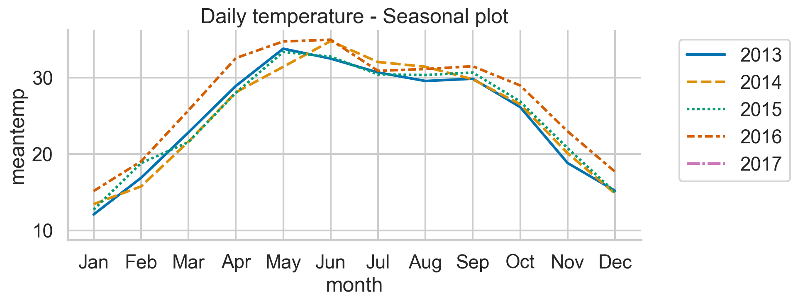
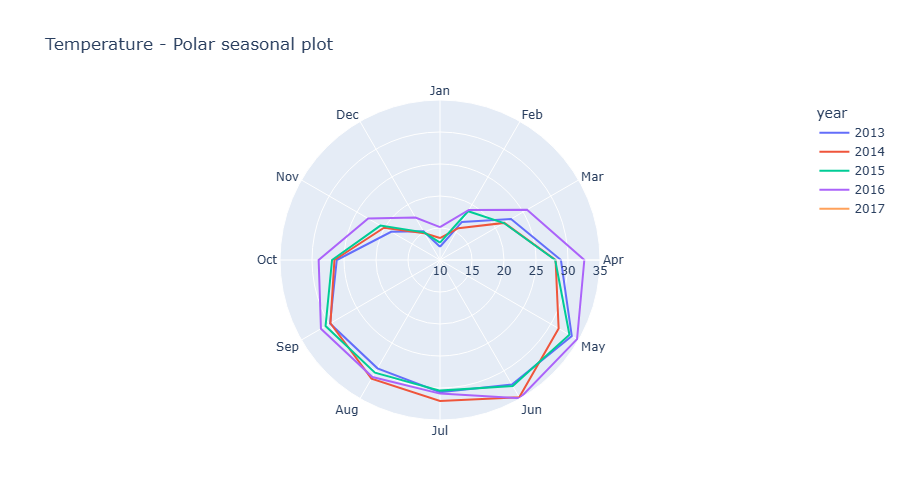
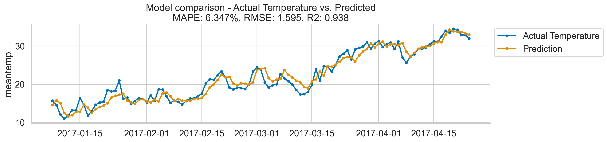

# Daily-Delhi-Weather-Forecasting
- Author: Patrick L. Mthisi
- Contact details: patrickmthisi@hotmail.com

## Project description and objectives:

About the dataset:

This dataset provides data from January 1, 2013, to April 24, 2017, in the city of Delhi, India. The 4 parameters here are
meantemp, humidity, wind_speed, meanpressure. The dataset can be found via: https://www.kaggle.com/datasets/sumanthvrao/daily-climate-time-series-data/data

In this end-to-end project, we forecasted the mean daily temperature for the period from January 1, 2017, to April 24, 2017. We employed a suite of different machine learning algorithms, including support vector machines (SVR), extreme gradient boosting (XGB), and LightGBM regressors. We also constructed an ensemble regressor, using Ridge regression as the meta-model. Feature engineering utilized includes creating additional features based on radial basis function (RBF) to capture non-linear patterns and cyclical behaviors in the time series data, which the daily mean temperature data, our target, clearly exhibits:

Furthermore, we also included lag features to capture temporal dependencies within the series. 

## Conclusion and further work...

Our model yielded impressive results as indicated by the out-of-sample MAPE, RMSE, and R2 scores of 6.347%, 1.595, and 0.938, respectively. The results show clear outperformance of our model compared to the majority of work on this dataset showcased on Kaggle:

For reference, please follow: 

https://www.kaggle.com/datasets/sumanthvrao/daily-climate-time-series-data/code
